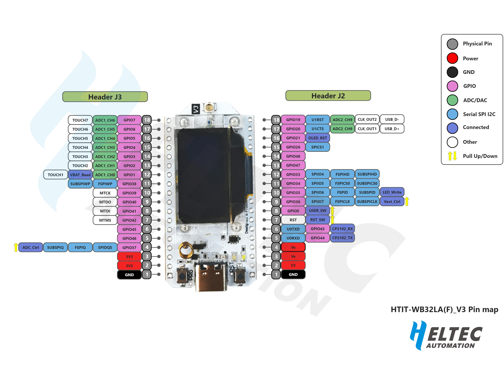
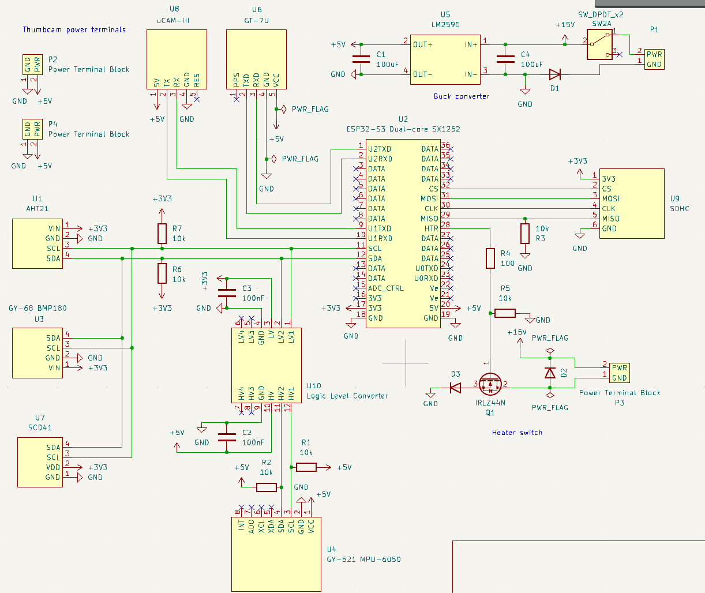

# PHAT3-Software

This code will run on the
[Heltec ESP32 LoRA V3](https://docs.heltec.org/en/node/esp32/wifi_lora_32/index.html) (915 MHz) aboard the
[PHAT-3 mainboard](https://github.com/UWCubeSat/PHAT-3-Main-Board).

It will save data from PCB-mounted sensors to a micro SD card, as well as transmitting it over LoRA.

This software uses the Arduino framework. We recommend editing it with the [Arduino 1 IDE](https://docs.arduino.cc/software/ide/#ide-v1) ("legacy").

Sensor purchase requests:
- [Purchase 1](https://docs.google.com/spreadsheets/d/1dPWJqdXrCmhPzfS-cPAt9ABr9ZaCJCoQ50nD71KFVlc/edit?usp=sharing)
- [Purchase 2](https://docs.google.com/spreadsheets/d/1_jEgsWjWWhrQImKw_u3TRmB3PyZUZdtXv6XSBbfWu6M/edit?usp=sharing)

## Sensors Documentation

### U1: AHT21
Temperature and humidity sensor

- [Purchase link](https://www.amazon.com/HiLetgo-Precision-Temperature-Humidity-2-0-5-5V/dp/B09KGW1G41)
- [AHT 21 Documentation](https://www.micros.com.pl/mediaserver/UPAHT21b_0001.pdf)
- 7-bit I2C Address: 0x38
- SCL: ESP schematic pin 11
- SDA: ESP schematic pin 12

### U3: GY-68 BMP180
Temperature and pressure sensor

- [Purchase link](https://www.amazon.com/ACEIRMC-Temperature-Barometric-Pressure-Arduino/dp/B091GWXM8D?th=1)
- [BMP180 Documentation](https://cdn-shop.adafruit.com/datasheets/BST-BMP180-DS000-09.pdf)
- 7-bit I2C address: 0x77
- SCL: ESP schematic pin 11
- SDA: ESP schematic pin 12

### U4: GY-521 MPU-6050
Accelerometer

- [Purchase link](https://www.amazon.com/HiLetgo-MPU-6050-Accelerometer-Gyroscope-Converter/dp/B00LP25V1A?th=1)
- [GY-521 Documentation](https://mysii.gorriens.net/images/arduino/capteurs/gy-521_mpu-6050_3-axis_gyroscope_and_acceleration_sensor_en.pdf)
- 7-bit I2C address: 0x68 (because AD0 pin is disconnected)
- SCL: ESP schematic pin 11
- SDA: ESP schematic pin 12

### U6: GT-U7
GPS

- [Purchase link](https://www.amazon.com/Navigation-Positioning-Microcontroller-Compatible-Sensitivity/dp/B0B31NRSD2)
- [GT-U7 Documentation](https://images-na.ssl-images-amazon.com/images/I/91tuvtrO2jL.pdf)
- [Specification page](https://electropeak.com/goouuu-tech-gt-u7-gps-module?srsltid=AfmBOorSbzLZmO6AaI3c2ZwXSbQamj5tD6vPUmgBJb2MViNQ9iOdiHh1)
- UART GPS
- ESP -> GT-U7: ESP schematic pin 1 (U2TXD)
- GT-U7 -> ESP: ESP schematic pin 2 (U2TXD)

### U7: SCD41
CO2, temperature, humidity

- [Purchase link](https://www.amazon.com/Teyleten-Robot-Dioxide-Temperature-Humidity/dp/B0C622SS34)
- [SCD41 Documentation](https://sensirion.com/media/documents/48C4B7FB/66E05452/CD_DS_SCD4x_Datasheet_D1.pdf)
- 7-bit I2C address: 0x62
- SCL: ESP schematic pin 11
- SDA: ESP schematic pin 12

### U8: UCAM-III
Camera

- [Documentation](https://resources.4dsystems.com.au/datasheets/accessories/uCAM-III/)
- ESP -> UCAM: ESP schematic pin 9 (U1TXD)
- UCAM -> ESP: ESP Schematic pin 10 (U1RXD)

### U9: SD Card Reader
- [Purchase link](https://www.amazon.com/UMLIFE-Interface-Conversion-Compatible-Raspberry/dp/B0989SM146?th=1)
- SPI SD Card Reader
- Pin 29: MISO (sub -> main)
- Pin 30: CLK (clock)
- Pin 31: MOSI (main -> sub)
- Pin 32: CS (chip select)
